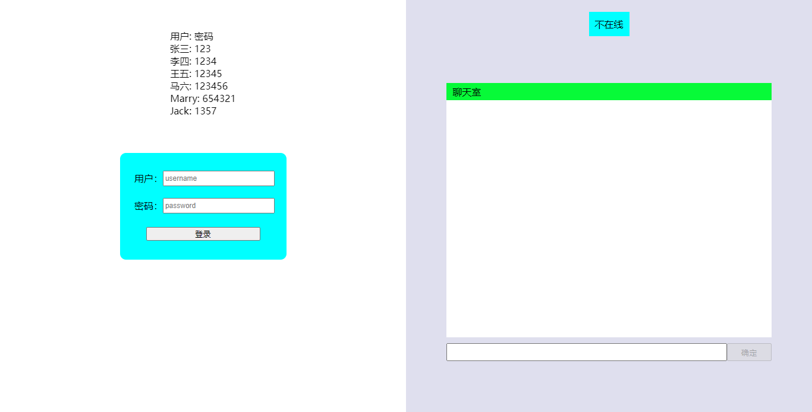
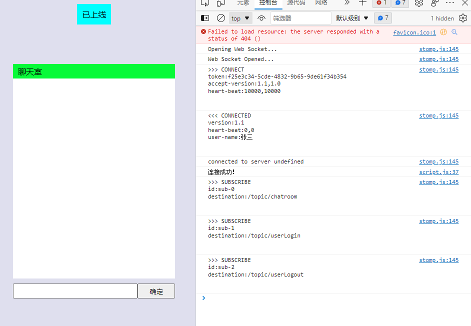
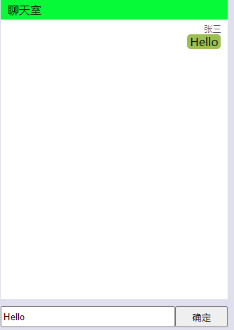
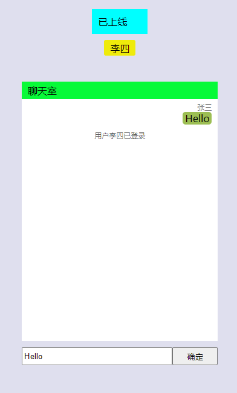
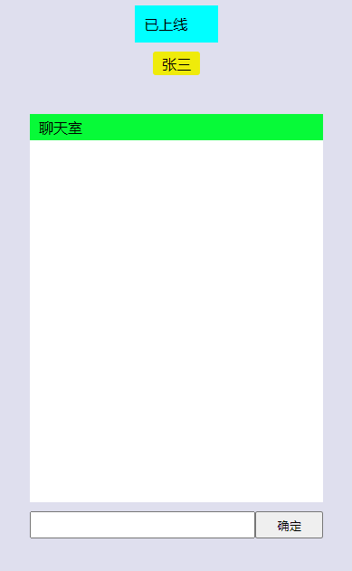
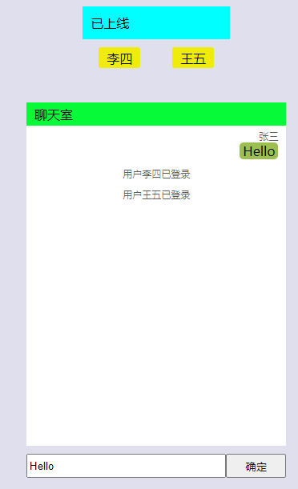
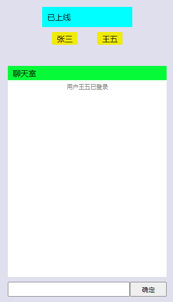
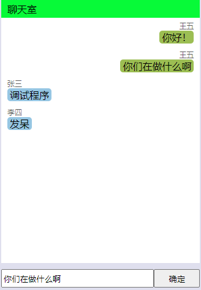
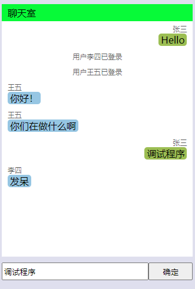
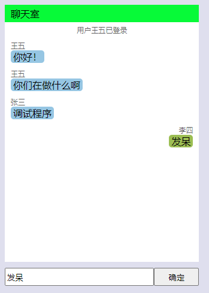

# 聊天室 Demo


# 项目依赖
```xml
<dependencies>
    <dependency>
        <groupId>org.springframework.boot</groupId>
        <artifactId>spring-boot-starter-web</artifactId>
        <version>2.6.2</version>
    </dependency>
    <dependency>
        <groupId>org.springframework.boot</groupId>
        <artifactId>spring-boot-starter-websocket</artifactId>
        <version>2.6.2</version>
    </dependency>
    <dependency>
        <groupId>org.webjars</groupId>
        <artifactId>stomp-websocket</artifactId>
        <version>2.3.4</version>
    </dependency>
    <dependency>
        <groupId>org.webjars</groupId>
        <artifactId>sockjs-client</artifactId>
        <version>1.5.1</version>
    </dependency>
</dependencies>
```

# 项目介绍
1. 只是一个示例项目，并没有连接数据库，也没有使用配合的mq。
项目启动后，打开浏览器输入http://localhost:1001/index.html，该Demo项目只有这一个页面。
用户需要先登录，才能在聊天室聊天，账户/密码页面上有，如果需要额外添加，可以去AllUserList类中添加。

2. 然后用户就可以发送信息了


3. 浏览器打开新的标签，打开页面http://localhost:1001/index.html，再登录一个账号。
李三这边就会显示在线用户，并且聊天框中提示用户上线


4. 李四这边也会显示在线用户张三


5. 再登录一个账号，张三这边


6. 李四这边



7. 开始聊天





